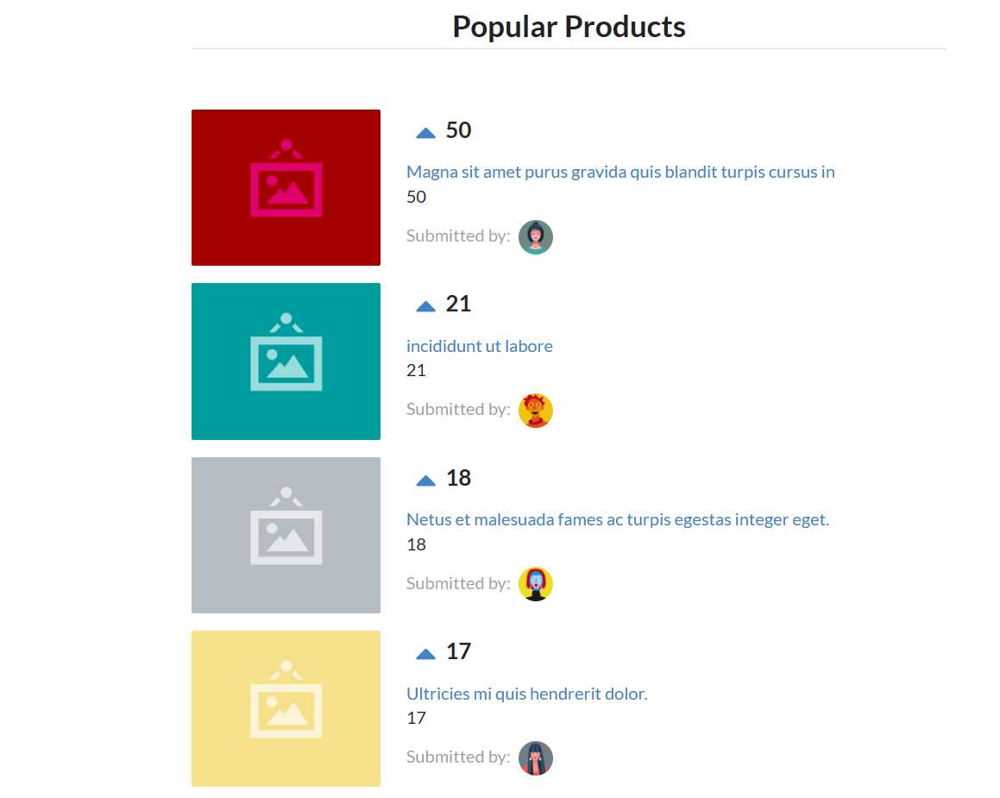

# VotingApp



Nesse projeto, desenvolvi uma aplicação em [React](https://reactjs.org/) similar ao [Reddit](https://www.reddit.com/).

Na aplicação é possível votar positivamente nos produtos apresentados, sendo esses classificados automaticamente segundo a quantidade de votos recebida.

Também usei o framework [Semantic UI](https://semantic-ui.com/) durante o desenvolvimento para criar layout responsivo usando HTML "amigável". 

### Running the app

1. Ensure you have `npm` installed.

Follow the instructions for your platform [here](https://github.com/npm/npm).

2. Install `http-server`

```
npm install
```

3. Boot the HTTP server

```
npm run server
```

The server is now running at [localhost:3000](localhost:3000)
